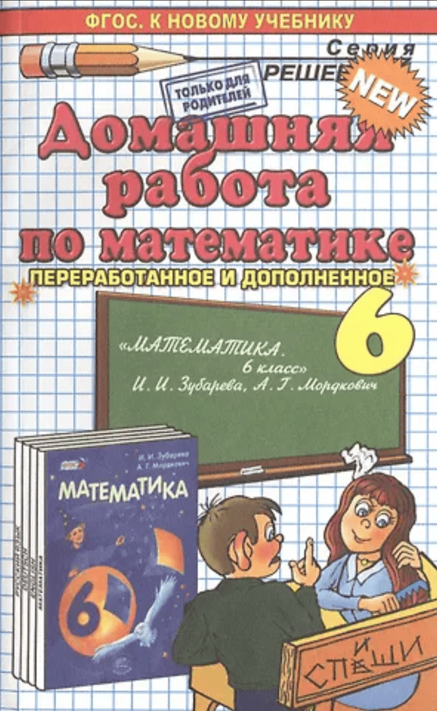

# Как подготовиться к алгоритмическому собеседованию в Яндекс

В конце января мне написал рекрутер из Яндекса с предложением пройти алгоритмическое собеседование. На тот момент у меня было решено всего 55 задач на LeetCode, из которых 50 — по SQL. Знания в области алгоритмов были практически на нуле.

Я решил взять паузу на два месяца и сосредоточиться на подготовке. В конце марта я успешно прошёл первый этап. О том, как прошли остальные этапы, расскажу ближе к концу статьи.

В этой статье я хочу поделиться своим опытом подготовки: как я готовился, какие стратегии использовал и что в итоге действительно помогло.

## Ошибки новичков

Среди моих знакомых много ребят, которые начинают подготовку к алгоритмическому собеседованию. Я заметил у них типичные ошибки. Вот они:
1. Нет четкого плана подготовки.
2. Прорешивание всех задач подряд без разделения по темам.
3. Попытки решать задачи исключительно в одиночку — самостоятельно, без подсказок и разбора решений.
4. Решение задач без обсуждения с другими — ни с кем не делятся идеями и не получают обратную связь.
5. Отсутствие конкретной цели подготовки.

## Для кого нужны алгоритмы?

Алгоритмы важны в первую очередь для стажёров. Они необходимы, чтобы пройти такие отборы, как Тинькофф Контест, Яндекс Контест или Ozon Route 256, а также при поступлении в другие крупные IT-компании.

При этом свою первую работу можно найти и без глубоких знаний алгоритмов. Это лишь один из способов отбора, и в другой компании он может осуществляться по-другому: через собеседования, на которых задают теоретические вопросы, через лайвкодинг с упором на особенности языка программирования, через код-ревью (что сейчас становится всё более популярным), а также через выполнение тестовых заданий.

Для опытных специалистов (мидлов и синьоров) алгоритмы также могут понадобиться — чтобы пройти соответствующую секцию на техническом интервью. Однако и здесь всё зависит от конкретной компании и позиции, на которую вы претендуете.

## Зачем большие компании устраивают алгоритмические собеседования, если они всё равно не применяются в реальных задачах?

На мой взгляд, это хорошая форма отбора и фильтрации слабых или неподходящих кандидатов. Понять и выучить несколько сотен алгоритмических задач — это далеко не простая задача. Это требует много времени, терпения и умения мыслить логически.

Выучить теоретические вопросы гораздо проще, чем решить логическую задачу, особенно в условиях ограниченного времени. Алгоритмические задачи позволяют выявить тех, кто действительно умеет думать, а не просто запомнил материал.

## Как проходит интервью

На реальном интервью интервьюрер и кандидат подключаются в одну видео-конференцию. Интервьюрер скидывает ссылку на платформу для написания кода code.avito или code.yandex. Это онлайн-платформы, в которых придется писать код. По сути это онлайн-редактор кода, в котором кандидат пишет решение задачи, а интервьюрер наблюдает в реальном времени за процессом. В них писать код гораздо сложнее чем в привычной ide, в которой есть подсветка синтаксических ошибок и автодополнение кода. На этих платформах таких подсказок нет.

На мок-собеседованиях я смог побывать в роли интервьюрера и кандидата. Постараюсь описать процесс и алгоритм действий с каждой стороны.

Кандидат:
1. Получает алгоритмическую задачу, тщательно читает её условия и задаёт уточняющие вопросы.
Примеры уточняющих вопросов:
- Отсортирован ли входной массив.
- На вход подаются только ASCII-символы
- Могут ли быть дубликаты в массиве/списке?
- Можно ли менять входной массив по месту или вернуть новый массив?
2. Подробно описывает алгоритм своего решения так, чтобы интервьюрер понял ход его мысли.
3. Проверяет по имеющимся тестовым кейсам свое решение. Для этого можно использовать комментарии текстом в платформе для написании кода или открыть платформу для рисования и в ней описать свой алгоритм.
4. Оценивает свой алгоритм по времени и памяти.
5. Выражает свою готовность интервьюреру начать писать код и после получения подтверждения приступает к написанию кода.
6. После завершения написания кода проходиться по коду снова и исправяет синтаксические и логические ошибки. Проводит мысленный дебагинг.
7. Сдает свое решение и сообщает о завершении написания кода.
8. На всех этих этапах кандидату важно не молчать, а постоянно думать вслух и описывать ход своих рассуждений. Это помогает интервьюеру понять ход мыслей и, в случае попадания в тупик, направить в правильную сторону.

Интервьюрер:
1. Должен понять предложение решение и задать уточняющие вопросы, чтобы убедиться, чтобы кандидат верно понял условие задачи.
2. Попросить кандидата оценить решение по времени и памяти. Если оценка некорректная подвергнуть ее критике и попросить сделать переоценку.
3. Если алгоритм решения не учитывает все тестовые случаи подобрать дополнительные тестовые кейсы, чтобы поставить под сомнение предложенное решение и подвести кандидата к правильному решению. Попытаться добавить дополнительные тестовые кейсы с граничными случаями и прогнать по ним предложенное решение.
4. Если предложенное решение является неоптимальным, постараться подвести к правильному решению путем внесения небольших подсказок и предложений.
5. При обнаружении ошибок в коде и неточностей дать небольшие наводящие подсказки об этом, чтобы кандидат сам смог найти их и исправить.
6. Если кандидат идёт в верном направлении стараться не мешать и не отвлекать его. Иногда это бывает сложно, приходиться бороться с желанием ускорить процесс и дать подсказку. Но, побывав однажды в роли кандидата, начинаешь понимать, как бывает сложно сосредочиться под давлением интервьюрера.
7. Если кандидат замкнулся в своем решении мягко растормошить его, попытаться понять ход его решения и, в случае затруднений, мягко направить кандидата в правильную сторону, не давая готового ответа.

#### Перед тем, как написать эту статью я прочитал книгу Барбары Оакли "Думай как математик". Это книга про то как эффективно решать математические задачи. Советы, которые описаны там хорошо ложаться на решение алгоритмических задач. Далее я хочу осветитить несколько идей из данной книги.

- [Книга Барбары Оакли "Думай как математик"](https://books.yandex.ru/books/v4PhgxOJ)

## Математическая тревожность

Математическая тревожность — тревожность или психическое расстройство, возникающее при любом оперировании числами или математической информацией. Её проявление не зависит от того, делает ли человек расчеты или просто пытается запомнить номер телефона. При столкновении с математикой у человека резко путаются мысли, и теряется фокус.

Одно дело — решать задачу самостоятельно, в комфортной обстановке, без ограничений по времени. И совсем другое — решать её в режиме реального времени, когда за твоим кодом следят, задают вопросы и при этом ставят в жёсткие временные рамки. Я знаю многих ребят, да и сам когда-то был в их числе, кто испытывает страх перед лайвкодингом и собеседованиями. С этой проблемой можно справиться за счет постоянной практики.

## Мышление сфокусированное и рассеянное

Сфокусированное мышление можно представить, как луч фонаря. У нас есть какая-то задача и все мыслительные ресурсы мобилизуются, чтобы решить её. В этот момент мы перестаём обращать внимание на все другие вещи.
Если задача сложная и нам долго не удается найти решение, можно прийти в тупик из которого так просто не выбраться. В этот момент полезно отпустить задачу и начать заниматься другими делами, сделать перерыв.
В этот момент мы переключаем мозг в рассеянное мышление. В этот момент можно увидеть общую картину. Возможно мы вообще идём не в том направлении. Перейдя в рассеянное мышление мы можем это отследить. Такой режим обдумывания позволяет мозгу смотреть на мир гораздо шире. Если вы пытаетесь понять или усвоить что-то новое, то лучше выключить точное сфокусированное мышление и включить рассеянный режим, позволяющий видеть широкую картину. Поймать рассеянное мышление не так просто. Самый простой способ перейти в него встать из-за компьютера и пойти на прогулку.

При решении сложной задачи мы вначале должны приложить к ней настойчивые усилия в сфокусированном режиме. Но чтобы довести задачу до конца нам нужно перейти в рассеянное мышление. При этом мы не можем использовать оба способа мышления одновременно. Если мы сознательно фокусируем внимание на задаче, то рассеянное мышление блокируется.

## Рабочая память и долговременная память.

Рабочая — это часть памяти, которая имеет дело с текущей, сознательно обрабатываемой информацией.
Вы можете удерживать в рабочей памяти четыре объекта. Когда при изучении естественных наук или математики вы осмысливаете и запоминаете некое понятие, оно начинает занимать меньше места в рабочей памяти. Тем самым появляется свободное пространство для мыслительных процессов, и вы можете усваивать другие понятия
Как удержать объекты в рабочей памяти? Часто этому помогает повторение — например, вы можете повторять сами себе телефонный номер, если его не на чем записать. Или же в попытке сосредоточиться можно закрыть глаза, стремясь отгородиться от лишних раздражителей, которые норовят просочиться в рабочую память.

В отличие от рабочей памяти долговременную память можно сравнить со складом. Попавший в нее объект обычно остается там надолго. 
Исследования показали: когда мозг впервые помещает конкретную информацию в долговременную память, то нужно еще несколько повторений — тогда информацию будет проще найти потом, когда она понадобится.

При изучении математики и точных наук долговременная память тоже важна, поскольку именно в нее вы складываете фундаментальные понятия и приемы, которые вам понадобятся при решении задач. Для перемещения информации из рабочей памяти в долговременную требуется время. Помочь этому процессу может прием, называемый интервальным повторением. Как вы догадались, это растянутое на несколько дней повторение того, что вы хотите запомнить.

Если возвращаться к изучаемому материалу через день, т.е. растягивать процесс на несколько суток, итог будет иным, нежели при других схемах усвоения. Исследования показали: если для запоминания определенного материала повторять его 20 раз в течение одного вечера, результат будет куда хуже, чем в случае, если повторять его столько же раз на протяжении нескольких дней или недель.

Пусть мозг поработает в фоновом режиме
В следующий раз, когда вам попадется сложная задача, поработайте над ней несколько минут, а когда зайдете в тупик — переключитесь на другую. Первая задача при этом будет обдумываться в рассеянном режиме, фоном. Когда позже к ней вернетесь, вы, скорее всего, приятно удивитесь тому, насколько продвинулись в ее решении.

## Интервальное повторение или распределенная практика.
Если повторять какую-то тему на протяжении нескольких дней это намного эффективнее, чем если повторять столько же раз на протяжении одного дня.

## Иллюзия компетентности

Иллюзия компетентности, также известная как эффект Даннинга-Крюгера, это когнитивное искажение, при котором люди с низким уровнем компетентности в определенной области переоценивают свои способности и знания. В результате они склонны считать себя более компетентными, чем они есть на самом деле.

При решении алгоритмических задач мы тоже можем столкнуться с этим эффектом. Нам кажется, что если мы решили задачу один раз, то мы полностью разобрались с ней и запомнили ее. Иллюзия рушится, стоит один раз сходить на собеседование или попытаться решить задачу снова через несколько дней. Другими словами, нам нужно регулярно проверять свои знания, чтобы быть уверенными в них.

## Просмотр готового решения.

Существует две крайности — когда мы пытаемся решить задачу полностью самостоятельно и когда сразу смотрим готовое решение.

Если мы пытаемся решить задачу полностью самостоятельно, мы тратим на неё много времени. А время — это ценный ресурс, ведь нам нужно решить много задач и не один раз.

Если мы смотрим готовое решение, мы его не запоминаем, потому что не приложили никаких усилий, чтобы прийти к нему. Мозг перестаёт думать в этот момент. Он не потратил усилий, чтобы прийти к решению, а значит, скорее всего, не запомнит его.

Необходимо найти золотую середину при использовании обоих подходов. Есть задачи, до решения которых дойти крайне сложно — в этот момент нам нужно воспользоваться подсказками к решению. Можно на каждую задачу выделить 30 минут, чтобы догадаться до решения самому. Если решение не приходит, то можно сделать запрос в ChatGPT, в котором мы просим дать краткое объяснение идеи без написания кода, или посмотреть видеоразбор задачи. Главное — не смотреть готовый код, а понять ход рассуждений и реализовать решение самостоятельно. При таком подходе усилий для того, чтобы запомнить решение, будет достаточно. Чтобы перенести решение в долгосрочную память, мы закрепляем его через повторение в другие дни.

Я считаю, что в подсказках нет ничего плохого. Гораздо хуже — тратить несколько часов на решение каждой задачи. Это очень долго и непродуктивно. Увидев решение некоторых задач, вы можете обнаружить, что до их решения вы бы никогда не догадались.

Итоговый алгоритм такой:
1. Попытаться решить задачу самому.  
2. Если не получается — воспользоваться подсказкой или посмотреть разбор задачи.  
3. Реализовать решение в коде самостоятельно.  
4. Сравнить своё решение с эталонным и проанализировать отличия.  
5. Закрепить решение повторением через несколько дней.

Самое тяжёлое — это понять, чего от тебя хотят и как этого достичь, понять условие задачи и алгоритм решения. Как только придёт понимание, решение в коде придёт само. Останется только воспроизвести его в коде, написать и прогнать под известные тестовые случаи, а также придумать граничные случаи.

## Дневник ошибок

На реальном собеседовании у вас не будет возможности запустить код. Вам нужно будет научиться писать код с минимальным количеством ошибок и прежде чем сдавать решение хорошенько подумать, пройтись по коду и исправить ошибки. Когда вы завершаете написание кода при запуске кода очень важно зафиксировать и выписать ошибки в отдельный список — дневник. Это помогает отследить повторяющиеся ошибки, проанализировать и избежать их в будущем.

## Компилятор в голове

Очень важно после написания кода представить решение с минимальным количеством ошибок. При этом ошибки могут быть синтаксические и логические. Перед сдачей решения необходимо пройтись по коду и исправить эти ошибки. Полезно отстраниться от написанного и представить, будто вы видите этот код впервые. К каждой строчке кода следует относиться критически. Также рекомендуется протестировать код на известных тестовых примерах — это помогает выявить логические ошибки и несоответствия.

## Паттерны

Очень важно при решении задач фокусироваться не на количестве задач, а на количестве тем — паттернов. Освоив один паттерн, мы сможем дополнительно решить ещё десятки похожих задач. К тому же мы не знаем, из какой темы прилетит задача на собеседовании. Чем больше паттернов освоено, тем выше шанс успешно пройти собеседование.

Ссылки на статьи с паттернами:  
- [LeetCode Patterns — Code In Motion](https://www.blog.codeinmotion.io/p/leetcode-patterns?open=false#%C2%A7sliding-window)  
- [15 LeetCode Patterns — AlgoMaster](https://blog.algomaster.io/p/15-leetcode-patterns)

## Цель

При работе над таким масштабным проектом, как изучение алгоритмов, важно с самого начала понимать зачем это делается. Без чётко сформулированной цели легко потерять мотивацию, отвлечься или перегореть. 

Нужна какая-то конечная цель, которая будет служить ориентиром. Примеры таких целей:
1) Пройти алгоритмическое собеседование в конкретную компанию.
2) Решить 100 задач по различным темам на LeetCode.
3) Пройти до конца какой-нибудь алгоритмический курс или контест.

Я поставил себе цель — пройти алгоритмическое собеседование в Яндекс. Это помогало придерживаться определённого курса и не бросать начатую затею.

## Окружение

Подготовка к алгоритмическому собеседованию большой тернистый путь. Чтобы не сойти с этого пути очень важно найти себе попутчиков, которые помогут не сойти с этого пути. С такими людьми можно обсудить свое решение, можно делиться успехами и отслеживать прогресс друг у друга.

Среди своих друзей и знакомых я нашел такое окружение. Мы создали небольшой чатик в телеге, где мы каждый день делимся задачами, которые удалось решить задачи на протяжении дня. Это помогает отслеживать прогресс других. Когда я вижу, что кто-то постоянно решает задачи, мне не хочется отставать от них, я получаю дополнительную мотивацию на решение задач.

## Мок-собесы

Выше я показал, по какому сценарию нужно следовать каждой стороне — кандидату и интервьюеру. Чтобы еще лучше понять, как проходит реальный алго-собес, я бы еще посмотрел записи собесов, и тогда ничего не мешает провести мок-собес друг другу.

Если у вас нет подходящего окружения в офлайне, всегда можно найти подходящее окружение в онлайне. Есть много чатиков в телеге, которые специализируются на теме алгоритмов. Среди них можно найти себе партнера по мок-собесу, бросив клич в этот чат с сообщением: "Ищу человека для проведения взаимного мок-собеса". Когда-то давно я таким образом, написав в гоферский чатик, нашел себе опытного гофера, который устроил мой первый мок-собес по Go. Из нескольких сотен человек в чате откликнулся один человек, это был тимлид из ВайлдБерриз. Он хорошенько меня прожарил, я получил огромную пользу.

В этот раз я тоже нашел себе партнера по мок-собесу вышеуказанным образом. Это тема рабочая. Мне попался разработчик с большим опытом проведения собесов. Мы созваниваемся с ним почти каждый день и по очереди проводим друг другу мок-собесы. Таким образом, каждый получил более 10 мок-собесов. Кажется, что мок-собесы нереальные и не могут нести такую же пользу, как реальные, но это не так. На мок-собесе имитируется ситуация реального собеса. Устраивается созвон в зуме и показывается экран, нет возможности куда-то подглядеть, код полностью пишется из головы, элемент стресса все же присутствует, и каждая решенная задача на мок-собесе запоминается очень крепко в голове.

В момент стресса мозг очень усиленно начинает работать. Бывает такое, что ты получаешь задачу, которую никогда раньше не решал, и ты вообще не понимаешь, как ее решить, и ты даже не понимаешь, как подступиться к этой задаче, у тебя кипит адреналин и потеют ладошки. Ты сидишь и думаешь, долго думаешь, и тут внезапно, каким-то магическим образом, тебе в голову приходит решение. Сам бы ты эту задачу не решил, но находясь на собесе в условиях стресса, удивительным образом мозг работает лучше. Также постоянная практика помогает снизить стресс на реальном собеседовании, и решение задачи происходит на автомате.

## Менторство

Очень важно, когда мы осваим новый предмет или область, в которой мы новички, найти такого человека, который выступит для нас некой глыбой. Нам не хватает поддержки и советов от опытного человека. Нам нужно, чтобы кто-то более опытный, харизматичный и авторитетный сказал, как нужно поступать в той или иной ситуации. Мы ждём от такого человека подробный роадмап, конкретные шаги, что нужно сделать. Также в процессе выполнении задачи вы становимся уязвимы и слабы. Нам нужно, чтобы кто-то подошёл и сказал: Бро, ты все правильно делаешь. Продолжай дальше. У нас появляются глупые вопросы и мы хотим получить грамотные и четкие ответы на них.

## Курс по алгоритам

Почему-то большинство моих знакомых, которые изучают алгоритмы отвергают курсы по алгоритмам. Им кажется, что если они смогли решить задачу на литкоде, значит они готовы к решению задач на собеседованию.

По сути грамотный курс дает все вышеперечисленное. На курсе есть ментор - преподаватель, которому можно задавать различные вопросы. Он выступит для вас путеводной звездой, который будет мотивировать к изучению дополнительных задач. Курс дает окружение - вместе с вами в одном потоке стартуют обучение другие ребята, которые проходят этот путь вместе с вами. На курсе можно найти партнера по мок-собесу, я своего нашел именно там. В курсе есть подробный роадмап по обучению, в котором применяются вышеуказанные паттерны для решения задач.

В настоящее время существует множество курсов по алгоритмам. Например, у Яндекса есть курс «Тренировки по алгоритмам», на Balun Courses также представлен курс по алгоритмам, и даже Влад Тен из канала «Влад Тен» запустил свой курс.

Я не проходил эти курсы, но хотел бы порекомендовать Максима и его платформу algocode.io. Почему именно его? Максим занимается алгоритмами уже более 6 лет, и у него харизматичная и веселая подача. Для каждой задачи у него разработан собственный паттерн решения. Кроме того, он вместе со своей командой разработал собственную платформу — [algocode.io](https://algocode.io/courses/algo-big-tech)  — аналог LeetCode, но с более индивидуальным и понятным подходом.

На ней представлено подробное описание задач, понятный видео-разбор, который помогает быстрее понять условие и алгоритм решения без раскрытия готового ответа, а также эталонное решение, которое можно запомнить и воспроизвести на реальном собеседовании. На других курсах я не встречал ничего подобного.

Также мне очень нравятся курсы в формате буткемпа. Все одновременно стартуют одним потоком обучения и все проходят по одному плану обучения. Все сталкиваются примерно с одинаковыми проблемами. Ты знаешь, что ты не один. Это даёт дополнительную поддержку и мотивацию дойти до конца. Вышеуказанный курс работает по такому формату.

## Итог

В общем, у меня было 2 этапа алгоритмических собеседований.

На первом этапе мне попалась всего лишь одна задача на плавающее окно. С ней я благополучно справился.

На втором этапе попались 2 задачи: на плавающее окно и на бинарное дерево. С первой справился, со второй возникли сложности. Через пару часов получил сообщение от рекрутера с обратной связью. Одной решённой задачи недостаточно для прохождения на следующий этап. Словил фриз на полгода.

Эпопея с Яндексом довольно быстро закончилась, но я ни о чём не жалею. Я приобрёл ценный навык прохождения алгоритмических собеседований и теперь смогу попробовать свои силы в других крупных компаниях.

Прикладываю ссылки на эти задачи:  
- [Permutation in String](https://leetcode.com/problems/permutation-in-string/description/)  
- [Max Consecutive Ones III](https://leetcode.com/problems/max-consecutive-ones-iii/description/)  
- [Find Duplicate Subtrees](https://leetcode.com/problems/find-duplicate-subtrees/)

Если вам нравится, как и о чем я пишу – то буду благодарен за подписку на мой ТГ-канал [Go Alive](https://t.me/go_alive) (так вы точно не пропустите новые статьи).

